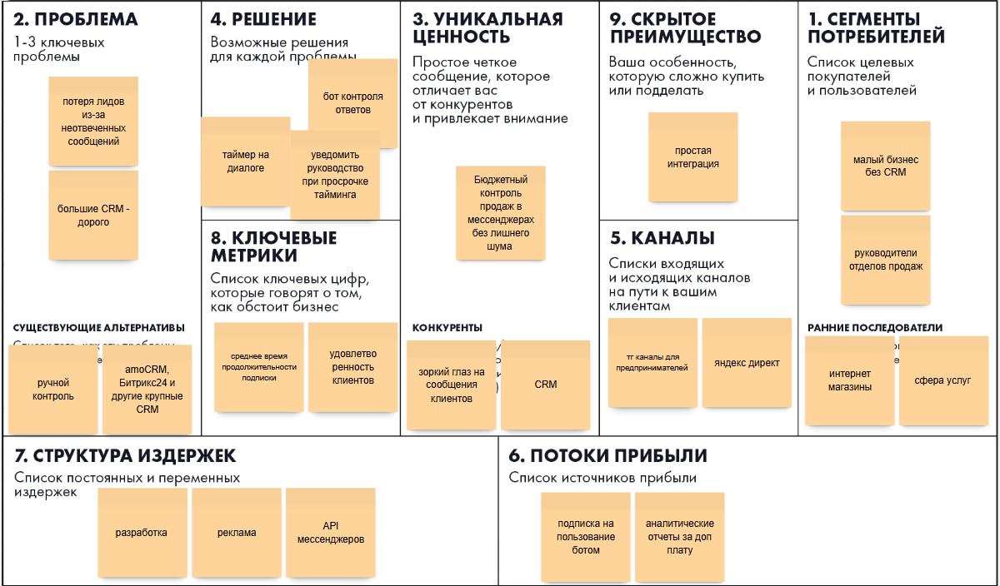
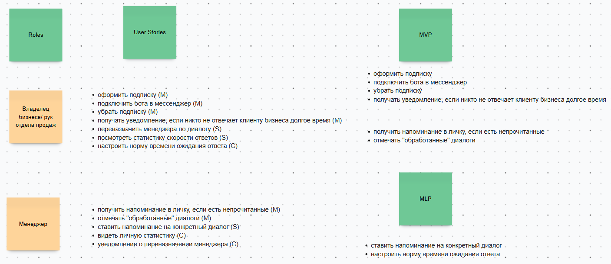
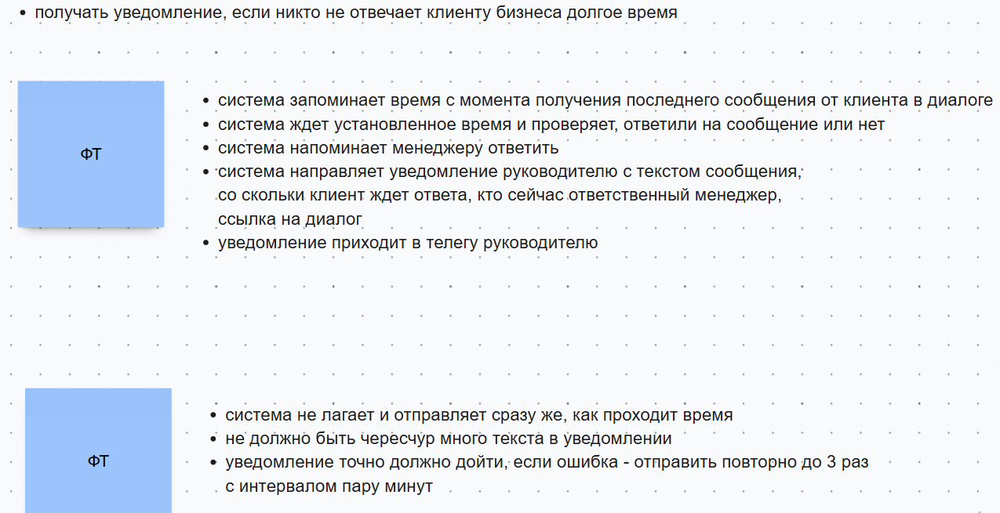
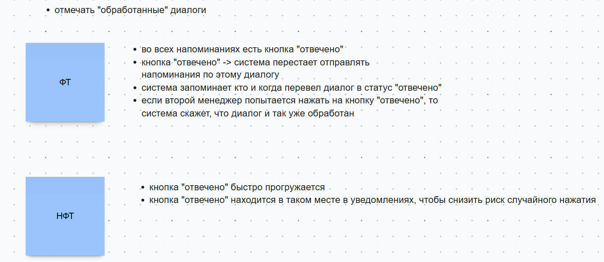
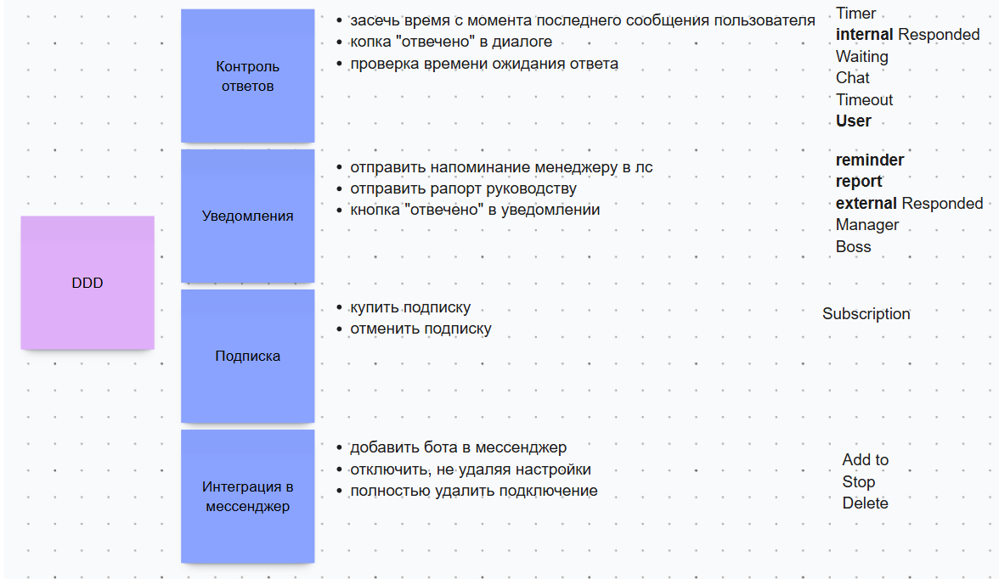
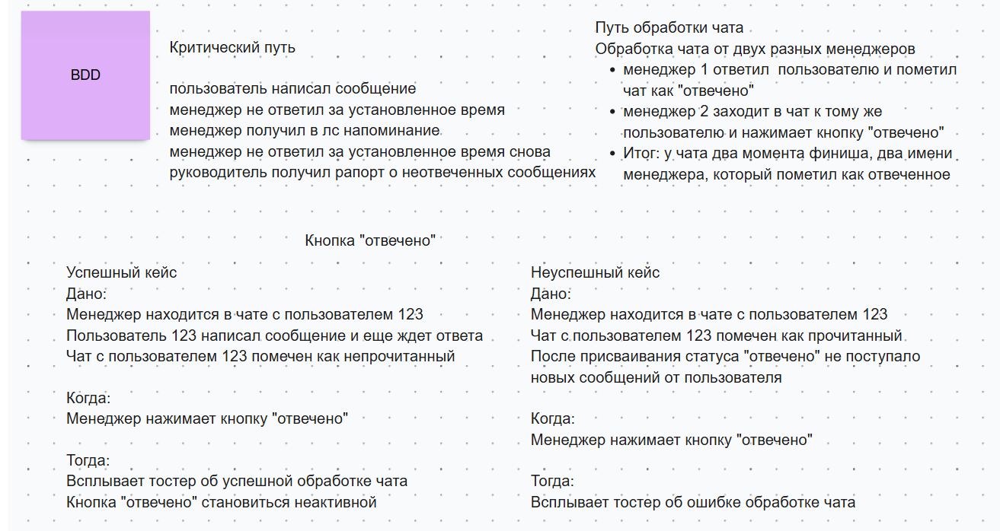
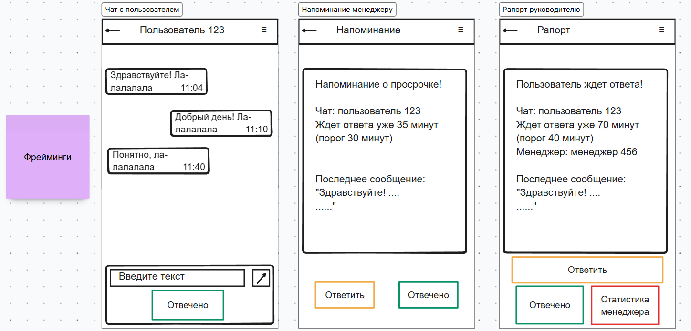
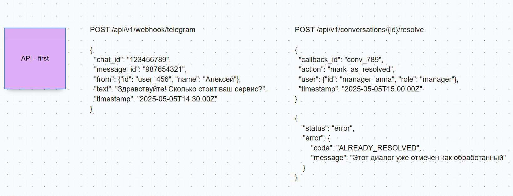
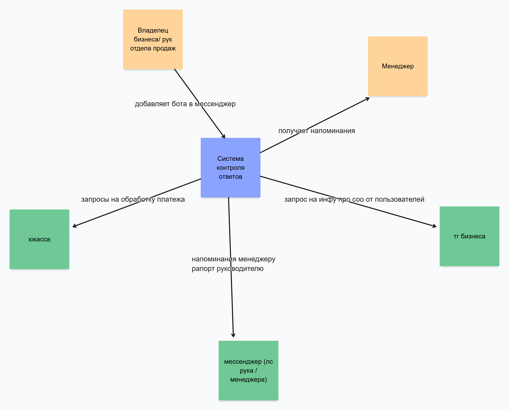
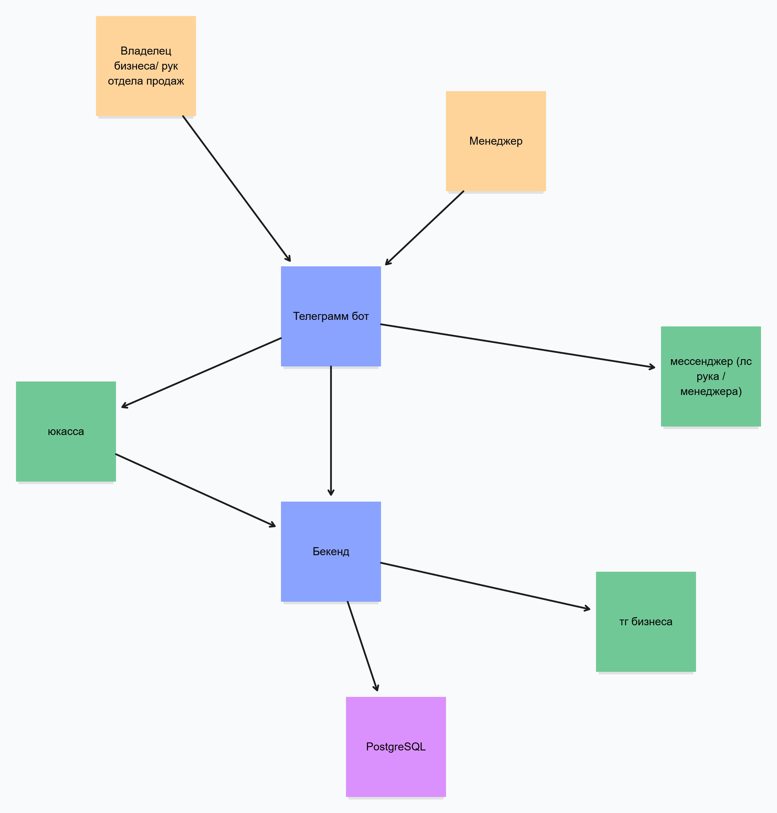

## Практическое задание 1

### Elevator Pitch

Владельцы малого  бизнеса теряют выручку из-за забытых сообщений клиентов в мессенджерах. 
Мы - платформа контроля ответов, которая подключается к мессенджерам, автоматически отслеживает время реакции на каждое сообщение. В отличие от больших CRM, которые стоят дорого и требуют внедрения, наше решение подключается за минуты и доступно для малого бизнеса. В результате малый бизнес получает инструмент контроля продаж без лишних затрат, а менеджеры начинают отвечать клиентам быстрее, сокращая процент потерянных сделок.

### Lean Canvas

## Практическое задание 2

### Roles, User stories, MoSCoW and MVP+MLP

#### Функциональные и нефункциональные требования

## Практическое задание 3

### DDD and BDD

### Фрейминги

### API - first

## Практическое задание 4

### C4 - 1 уровень

### C4 - 2 уровень

#### Стек

Python (легко и быстро написать) 
PostgreSQL (стандарт для стартапа)  
Redis (таймеры, просрочки и тп) 
aiogram 3.x (асинхронная)

## Практическое задание 5

### 1. Hiring Plan

**Product Manager** - Приоритизация фичей для MVP, коммуникация с клиентами и сбор фидбека  
**Backend Developer** - Telegram-бот (aiogram) + API (FastAPI), Интеграция с ЮKassa  
**Database** - PostgreSQL, Redis  
**QA** - Ручное тестирование сценариев

### 2. Development Framework: Scrum

1. Требования неизвестны заранее.
2. Короткие спринты дают быстрый работающий результат (MVP).
3. Приоритеты меняются на основе фидбека от пользователей.

### 3. Team Rituals
1. Выбрать задачи в спринт, декомпозировать (раз в 1-2 недели)
2. Синхронизация, выявление блокеров (каждый день)
3. Демо сделанного за спринт (в конце спринта)
