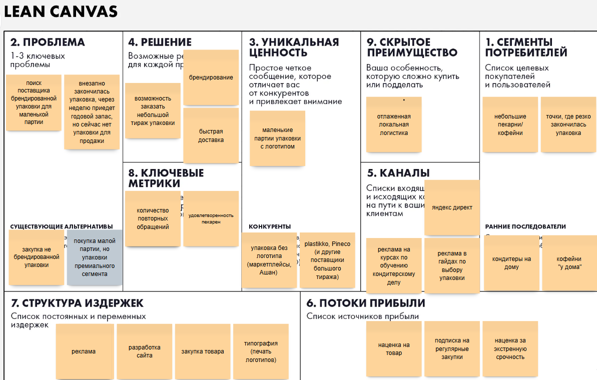

# Практическое задание 1

### Elevator Pitch

Небольшие пекарни и кофейни вынуждены закупать упаковку гигантскими партиями, потому что поставщики не хотят возить маленькие партии. В итоге деньги заморожены в коробках, которые годами пылятся на складе. 
Мы - поставщик брендированной упаковки малыми партиями. Приложение за 2 минуты формирует набор, и курьер привозит на следующий день. 
В результате, кофейни не переплачивают, не хранят лишнего и всегда имеют упаковку под рукой.

### Lean Canvas
